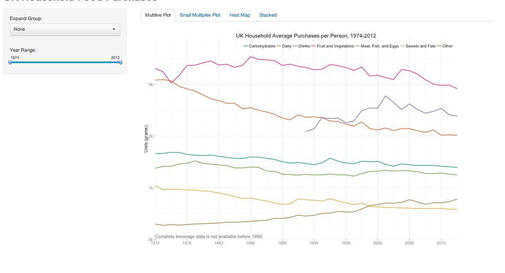
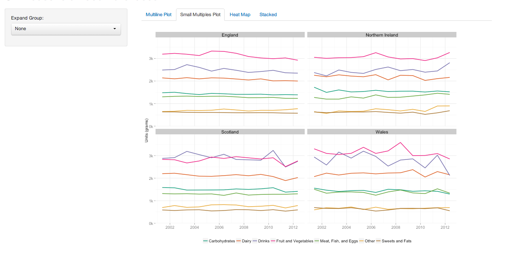
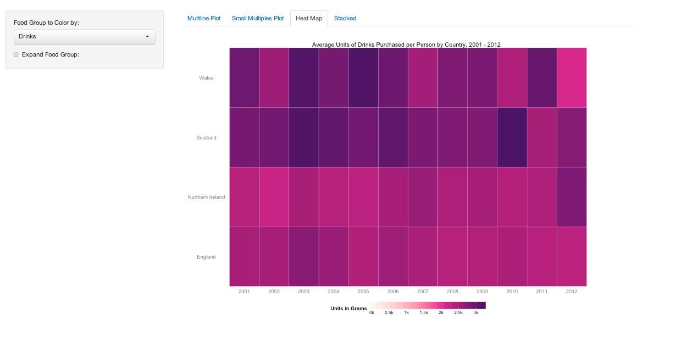
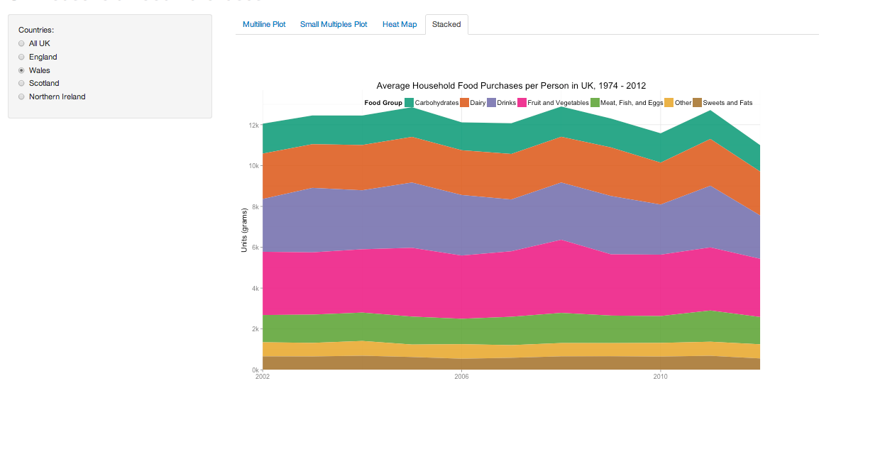

Final Project 
==============================

| **Name**  | Rachel Smith |
|----------:|:-------------|
| **Email** | rasmith2@dons.usfca.edu |

The following library must be installed before running this code: 

- `shiny`
- `ggplot2`
- `scales`
- `RColorBrewer`
- `reshape`
- `grid`

Use the following code to run this `shiny` app:

- `library(shiny)`
- `runGitHub("msan622", "rasmirac", subdir = "final-project")`

## Technique 1: Multi-Line Plot ##

For this plot, I had to put the data into the form: *Food Group*, *Variable*, *Value*, where Food Group indicates the food group of the purchased item, Variable is the year, and Value is the cummulative number of units sold on average per person for that food group and year. In order to get the value for each food group and year, I used the R function `aggregate`, and summed the units purchased by food group.  For the option of filtering the data by group, I used a different data frame that included the previous information as well as a column for *Description*, which indicated the more specific type of foods present in each food group. 

The lie factor here is not perfect. Because the dataset has food types measure in milli-liters and grams, I ended up not converting the units. I chose to ignore the minute differences in measurements because for nearly all foods the mapping from milli-liters to grams is one to one. I did, however, convert the number of eggs purchased to its average weight in grams. The data density here is fine -- there is not much data being shown beyond simple counts by year. However, the interaction of expanding food groups increases the density. The data to ink ratio is also good here as I eliminated any superfluous details. 

I think this particular plot does a great job showing the overall trends in food purchases in the UK. The multiple lines in the plot illustrates the differences among food groups. It also has the bonus feature of showing each food group individually -- which allows the user to see trends within groups that might be suprising. For example, I really found it interesting that milk sales decreased steadily within the dataset while cheese sales stayed constant. 

## Technique 2: Small Multiples Plot ##

For this plot, I used a very similar data structure as in the first plot, except I added a column for country. This addition allowed me to create a facet plot of the different countries with food purchases for each. When the user chooses the option to show the lines for within group categories, a column for Sub Categories is also added. 

Again, the lie factor is not great. I didn't convert the units to a common measurement because of the extreme similarity in the two units. I did, however, convert the number of eggs to the average weight in grams. The data density here is a bit higher because I show country along with average food purchases with the option to expand the lines by food group. The data to ink ratio is good. 

I like this plot because it breaks down the first plot into by country data. Instead of seeing the cummulative purhcases in the UK, you can see them by country, which I think is interesting. I especially find it interesting to see the differences in England and the other countries -- England's purchases stay pretty steady over the years while Scotland and Wales are much more volatile. The expanded food groups are interesting because you see trends country wide instead of trends for the whole UK. 

## Technique 3: Heat Map ##

I used the same data here as I did for the small multiples plot. When the user chooses the option to see the food group expanded out, I added a column for description. 

The lie factor is the same as the other plots -- I didn't convert all of the units to grams besides the units for eggs. I chose to leave the units as is because of the minute difference between the measurements and the inability to take into account the differences specific to each product. The data density here is relatively high. The data to ink ratio is okay. 

I usually don't like heat maps, but I find it usefull in this situation. While the other plots focused more on units sold per year over time. This plot focuses on changes in puchases over time. I also really like the option to break out the 
food group into it's sub groups. You can really see the differences in puchases among sub groups. For example soft drinks and alcohol are much more volatile than the other beverage types and there is a lot of variation among countries.

**Note**: I tried to do a choropleth here, but it is literally impossible to find a free shape file of the UK's countries. I think a traditional heat map is an okay compromise. 

## Technique 4: Stacked Area Plot ##

I used the same data here as I did for the multi-line plot. When the user chooses the option to see the country expanded out, I added a column for country.  

The lie factor is the same as the other plots -- I didn't convert all of the units to grams besides the units for eggs, which I calculated based on the average weight of an egg. I chose to leave the units as is because of the minute difference between the measurements and the inability to take into account the differences specific to each product. The data density here is relatively high. The data to ink ratio is okay. 

I think this plot goes nicely with the line plot because it shows the cummulative average units of food per person by food group. It's nice to see the overall trend in the UK for food purchases as well as the by country trend. This plot is probably my least favorite, but I think it's a good way of showing the data using a different technique. 

## Interactivity

### Multi-Line plot and Small Multiples Plot

Here the user can: 

- choose the food group to expand
- zoom in on a certain time period (for multi-line only)

I think these attributes enhance the visualization by showing more granualarity in the data. The trends for the individual components of the larger group are sometimes very different. For example, the dairy line seems to be decreasing overall, but closer inspection of the group shows that cheese purchases are very steady while milk purchases are decreasing. 

### Heat Map

For this plot the user can: 

- choose the food group to show
- choose to expand the food group into subcategories

I think the first interactivity is almost neccessary for this plot. It's nice to be able to choose which variable to show because this is what users are interested in -- trends in different groups. The second interaction is nice because it allows the user to compare the overall trend to sub group trends. 

### Stacked Area Plot 

This plot allows the user to: 

- choose the country shown

I like this interactivity because, again, it allows the user to compare the overall trends in the UK to country wide trends. Again, we see that the countries behave very differently. This is more useful than just seeing one version of the plot. 

## Prototype Feedback

For my prototype presentation, I only presented the multi-line plot without any interaction. Some of the feedback I got included: increase the thickness of the line, convert the data to a common unit, show change over time instead of the raw data, and to normalize the data. I didn't convert to a common unit because milli-liters and grams are basically the same and it would have been too difficult to do it by food type. I also didn't increase the thickness of the thin, because aesthetically I found the line thickness okay already. I liked showing the raw data because it makes the plots more accessible to the public, which is the audience I'd expect to be interested in these visualizations. 

## Challenges

The largest challenge I faced with the project was time. The end of the semester is always a super busy time -- unfortunately, I didn't get the time with this project that I wanted. Further, because the data was in a strange format originally, I spent a lot of time cleaning it up in both Python and R. Once I got into the format I wanted, I realized the data was not as rich as I had hoped. I managed to get four visualizations out of it, but I don't feel like I picked the best dataset to begin with. I also wish I could incorporated some of the other datasets from the same website. But again, the lack of time kept me from exploring more options. 