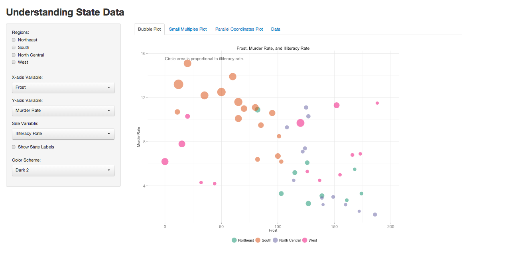
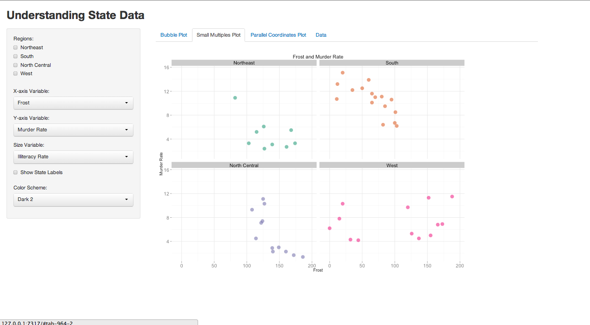
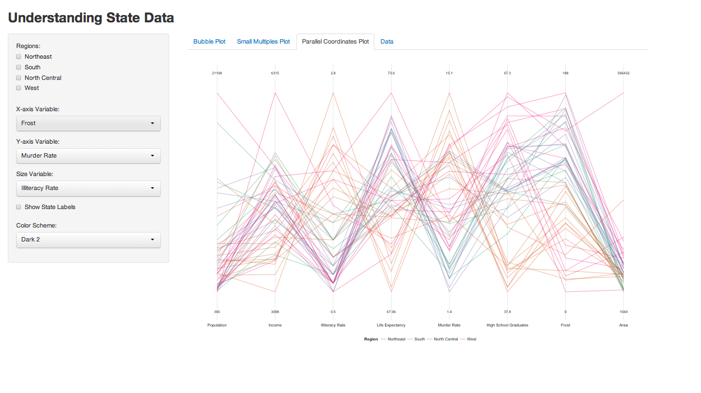

Homework 3: Multivariate
==============================

| **Name**  | Rachel Smith  |
|----------:|:-------------|
| **Email** | rasmith2@dons.usfca.edu |

## Instructions ##

The following packages must be installed before running this code: 

- `ggplot2`
- `shiny`
- `scales`
- `grid`
- `GGally`

Use the following code to run this `shiny` app:

- `library(shiny)`
- `runGitHub("msan622", "rasmirac", subdir = "homework3")`

## Discussion ##

### Technique 1: Bubble Plot ###

I chose this technique because I found it was a good way to illustrate a few of the variables in the same plot. It's also an easy plot to change the axes. Because I saw this as more of a exploratory visualization exercise, I allowed the user to choose which variables to show on the plot. The default is: 'Frost' on the x-axis, 'Murder Rate' on the y-axis, and the size dictated by 'Illiteracy Rate'. I chose this because there seems to be an interesting correlation between frost (which I understood as the overall temperature of the state) and the murder rate. It seems hot states have a higher murder rate and illiteracy levels. I chose to color the data by region so the user could easily pick out the different areas of the U.S. Beyond the ability for the user to decide the variables to show, I added the following options: 

- Change the color scheme. 
- Filter the regions.
- Allow the user to label the points. 

### Technique 2: Small Multples ###

I originally tried to use a scatterplot matrix for this plot. However, I quickly became frustrated with the difficulty of customizing the plot. I switched to small multiples for the ability to layer with ggplot. I choose the same default columns as with the bubble plot -- again with the option to change the columns chosen. I saw this a way to sort of 'brush' by breaking up the bubble plot into each region and inspecting the relationships region-wise. I didn't add a size variable to limit the number of features shown in this plot. I added the following options: 

- Change the color scheme.
- Change the variables shown on the x and y axes. 

### Technique 3: Parallel Coordinates Plot ###

I chose to include all the numeric columns in this plot. This way the user could explore possible relationships within the numeric variables across regions. Again, I used the region variable to color this plot. I normalized the coordinates for this plot to get a more accurate depiction of the relationships between variables. I show the maximum and minimum values for these variables on the top and bottom of the vertical lines. This plot offers the following forms of interactivity:

- Change the color scheme.
- Filter out the regions. 

### Interactivity ###

My Shiny app allows the user to really explore the state data. On the side panel, the user can choose to change the following plot options: 

- Filter the regions shown in the bubble plot and parallel coordinates plot. The parallel coordinates plot uses this option to highlight the selection regions. The bubble plot uses a subset of the data based on the regions chosen. 
- The x-axis option allows the user to choose a numeric variable to plot on the x-axis. This option affects the bubble plot and the small multiples scatterplot. I like this option because it allows the user to choose what relationships they want to see rather than showing only a static plot. 
- The y-axis option allows the user to choose a numeric variable to plot on the y-axis. This option affects the bubble plot and the small multiples scatterplot. I like this option because it allows the user to choose what relationships they want to see rather than showing only a static plot. 
- The size option dictates which numeric variable the bubble plot sizes by. This option does not extend to the other plots.
- The 'Show Labels' checkbox gives the user the option of labeling the points in the bubble plot. I think this is useful when exploring the data and seeing trends. 
- The final list is the color scheme. This allows the user to choose a color scheme they like the most. This option extends to all the tabs. 

### Overall Customization 

Some aesthetic choices I made are: 

- Added axis labels and titles that change with the user's choices. 
- Removed ggplot's grey background.
- Set constant axis limits and padding for all the plots. 
- Altered text size. 
- Formatted the variables measured in percentages. 
- Added space between small multiple plots. 
- Added 'Data' tab to show filtered dataset. 
- Many additional subtle changes. 
