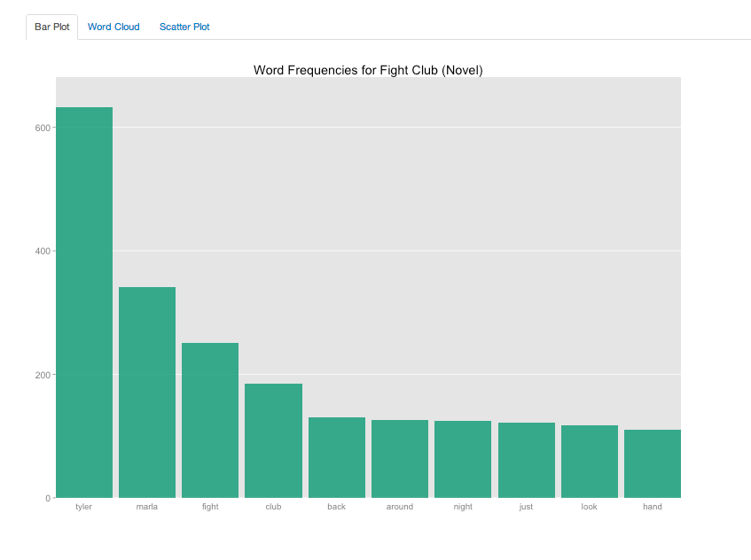
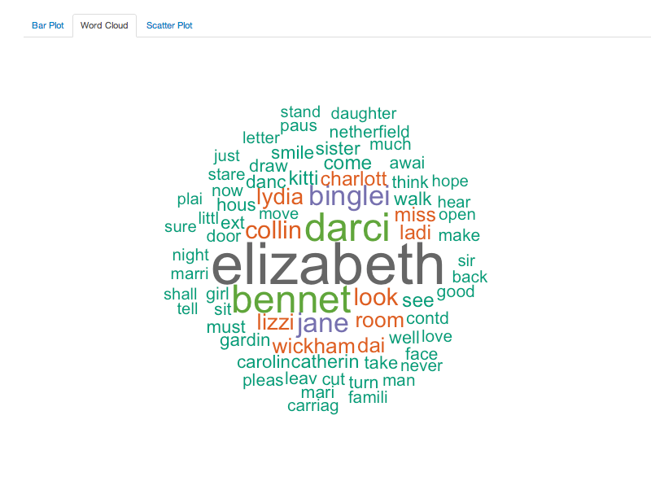
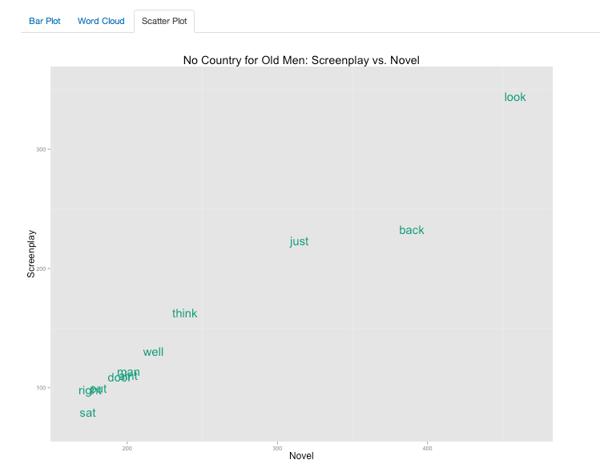

Homework [4]: Text
==============================

| **Name**  | Rachel  |
|----------:|:-------------|
| **Email** | rasmith2@dons.usfca.edu |

## Instructions ##

The following packages must be installed before running this code: 

- `ggplot2`
- `shiny`
- `scales`
- `tm`
- `SnowballC`
- `wordcloud`
- `RColorBrewer`

Use the following code to run this `shiny` app:

- `library(shiny)`
- `runGitHub("msan622", "rasmirac", subdir = "homework4")`

## Discussion ##

I created a Shiny App with minimal interactivity that allows users to compare screenplay and novel versions of some of my favorite works of fiction. 

### Dataset ###

For this project, I used text from the following screenplays and novels: Fight Club, No Country for Old Men, and Pride and Prejudice. I chose these three texts because they are works that I am very familiar with in both forms. I found the movie scripts from the Internet Movie Script Database, and I found the full text of the novels online through school websites. I used the `tm` package to munge the data and put it into a usable format. I removed stopwords along with some repetitive words (e.g. 'Jean' because it's the second half of the name 'Carla Jean'). I stored each of these datasets as a separate text `data.frame` and allowed the user to choose which one to use the visualizations. I was also careful to keep the novel and screenplay text separate as I was interested in seeing the differences in the two. 

### Technique 1: Bar Plot ###

This plot is just a simple plot of word frequencies by text and form of media. I chose this technique because it is a very clean and simple way of indicating how many words are in each document. I think the I decided not to show a faceted bar plot because I wasn't able to order the bars consistently in both. This plot is not very dense with data as it is only a simple count of words in each text by type of media. The data-ink ratio is pretty reasonable as it is a simple plot and is not very dense. The lie factor is very close to non-existent except for me removing some stopwords that I found to be repetitive or unimportant. 

I chose the color to be consistent with the other plots used in this Shiny App. I removed the vertical gridlines as they are unneccessary for bar plots. I also increased the text size of the plot title and axis labels. 

Interactivity: 

- Responds to user choice of text and media
- User can choose how many words to show

### Technique 2: Word Cloud ###

Although I don't usually like word clouds, I chose this technique because it allows the user to visually compare two types of media very quickly without having to look along an axis line. I feel that it works very well in conjunction with the simple bar plot. This is not very dense data-wise as it is hard to tell the frequency by the size and color of the words. Again, the only 'lies' present in this visualization is the removal of stop words. 

For this plot, I only made a few aesthetic changes. I chose my favorite color pallete (`Dark2`). I thought the addition of color adds a little more infomation than gleaned from size alone. I restricted the word size and the number of words to put on the plot. I tried to allow the user to dictate how many words are shown, but I had trouble adding that interactivity. 

Interactivity: 

- Responds to user choice of text and media

### Technique 3: Scatter Plot ###

This plot is my least favorite that I've done all semester, though I thought it was useful in this type of comparison. This plot shows comparative word frequency between the novel and screenplay. The data density is highest here because it shows a comparison of word frequencies. The data to ink ratio is really good. The lie factor is a little higher here because I jittered the points so the words aren't as jumbled as well as removed stopwords. 

I didn't make many aesthetic changes here. I increased the size of the text on the plot. I removed the smaller grid lines. I wish I had enough time to add in a sliding range for word frequencies, but I unfortunately lost a lot of time prepping the data and incorporating interactivity in the Shiny App. 

Interactivity: 

- Responds to user choice of text