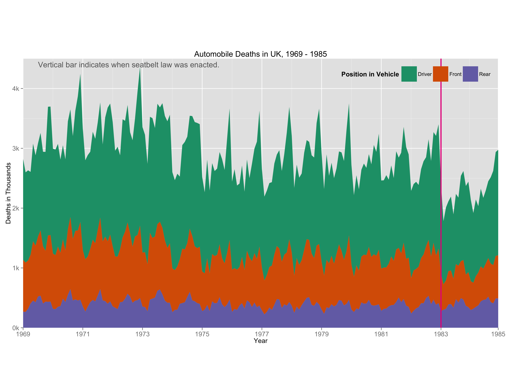
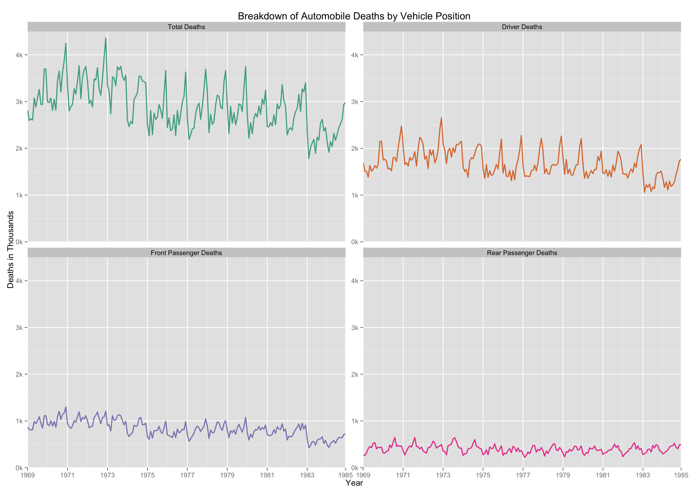
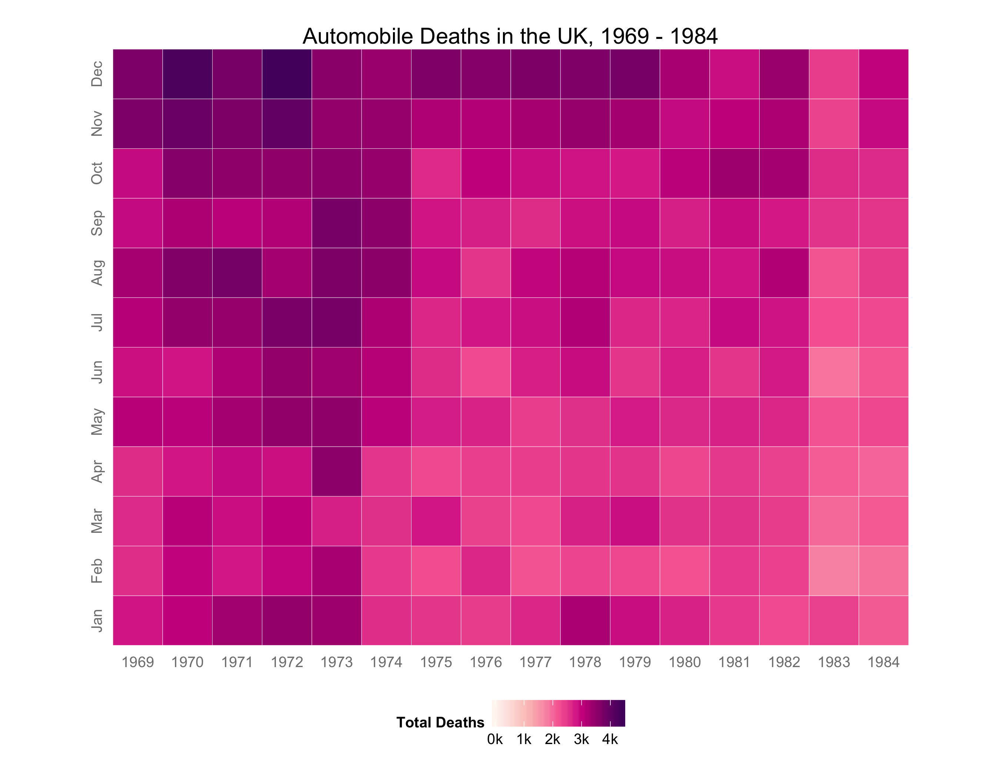

Homework 5: Time Series Visualizations
==============================

| **Name**  | Rachel  |
|----------:|:-------------|
| **Email** | rasmith2@dons.usfca.edu |

## Instructions ##

The following packages must be installed before running this code: 

- `ggplot2`
- `scales`
- `grid`
- `reshape2`

## Discussion ##

Because of time constraints I chose to create three static plots for this assignment. The three techniques I used are: stacked area plot, small multiples line plot, and heat map. I wanted to focus on automobile deaths for this assignment so I only focused on three columns of the dataset other than time: driver deaths, rear passenger deaths, and front passenger deaths. I assumed these are mutually exclusive so I created a new variable, total deaths, using the sum of the three variables. 

### Technique 1: Stacked Area Plot ###

I chose this techniques because I think it is the best way to show the makeup of all vehicle deaths. It shows clearly that rear passengers account the fewest deaths followed by front seat drivers, with the majority of deaths being drivers.  I also added a vertical line at the date when the seatbelt law was enacted (Jan 1983). This addition increases the amount of information offered by this plot and adds context to the data and my other plots. Beacause I didn't alter any of the data, the lie factor is very good. The data to ink ratio is maybe slightly lower than I'd like, but the data density is pretty high. If I had more time I'd like to make this an interactive plot with options to filter the years and possible add more variables. 

Some aesthetic changes I made: 

- Changed the default color scheme to the color brewer palette 'Dark2' 
- Added annotation to explain the veritical bar
- Formated the y and x axis to save space
- Changed the size of the legend 
- Set the aspect ratio
- Other small changes like text size

### Technique 2: Small Multiples Line Plot ###

I think this plot goes nicely with the stacked area. The stacked area plot can be slightly hard to read beyond getting an idea of proportion. The small multiples line plot makes it easy to see the raw number for deaths of people in different positions in cars. Further, it's easier to see here that the number of rear passenger deaths after 1983 didn't change very much while the number of front seat passengers and drivers changed more significantly. The lie factor is fine here considering I didn't alter any of the data. The data to ink ratio and data density are reasonable. 

Some aesthetic changes I made: 

- Changed the default color scheme to the color brewer palette 'Dark2'
- Changed the variable names for more clearly labeled facets
- Formatted the y-axis and x-axis
- Set the aspect ratio

### Technique 3: Heat Map ###

Because there seemed to be a yearly pattern in automobile deaths in the stacked area plots and small multiple line plots, I chose a heatmap as my third plot. I put the years on the x-axis (as it seems to be a more logical way of reading years) and the months on the y-axis. I used the variable *Total Deaths* as the coloring factor for the titles. I chose the coloring to be sequential because I am only looking for changes in the number of deaths (low to high) --  I thought it made more sense than I divergent color scheme. As we can see, there is a clear lightening of the tiles as time increase and the highest number of deaths occur in the months of November and December (maybe because of the holidays? -- drinking and driving or holiday traveling). The lightest tiles are in the years 1983 and 1984 after the seatbelt law. The data to ink ratio here is okay -- maybe a little low, but the data density is high. The lie factor, again, is fine since I did no alterations of the data. 

Some aesthetic changes I made: 

- Set the color scheme to be mostly consistent with the other plots
- Formatted the values on the legend
- Formatted the x and y axis values

Overall, I wish I had more time to make interactive Shiny apps. I would have liked to do some more complicated filtering and animation. 