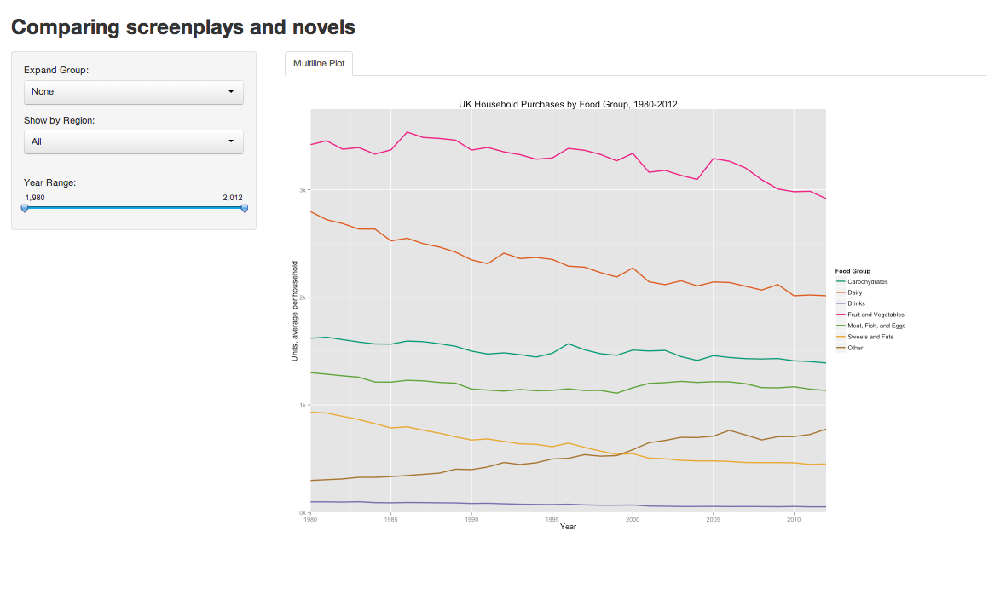

Project Prototype
==============================

| **Name**  | Rachel Smith |
|----------:|:-------------|
| **Email** | rasmith2@dons.usfca.edu |

Use the following code to run this `shiny` app:

- `library(shiny)`
- `runGitHub("msan622", "rasmirac", subdir = "project-prototype")`

## Dataset ##

My dataset contains average food purchases per household in the UK during the years 1974-2012. Along with common pantry items, the dataset also reports 'eating out' habits, and data by region.  

## Discussion ##

As seen above, I created a Shiny App with only UI elements and a static multi-line plot. To create this multi-line plot, I grouped the food into traditional 'food groups' then combined the purchases by year. I then plotted these time series for the user to see how purchases changed over time. For interactivity, the user will be able to choose to expand food groups (for example Meat, Fish, and Eggs will break out into puchases for each variable in that group). The user will also be able to see purchases by region and limit the year range. Obviously all of these elements are in their early stages. I will likely add interactivity as I add more to my plots. 

