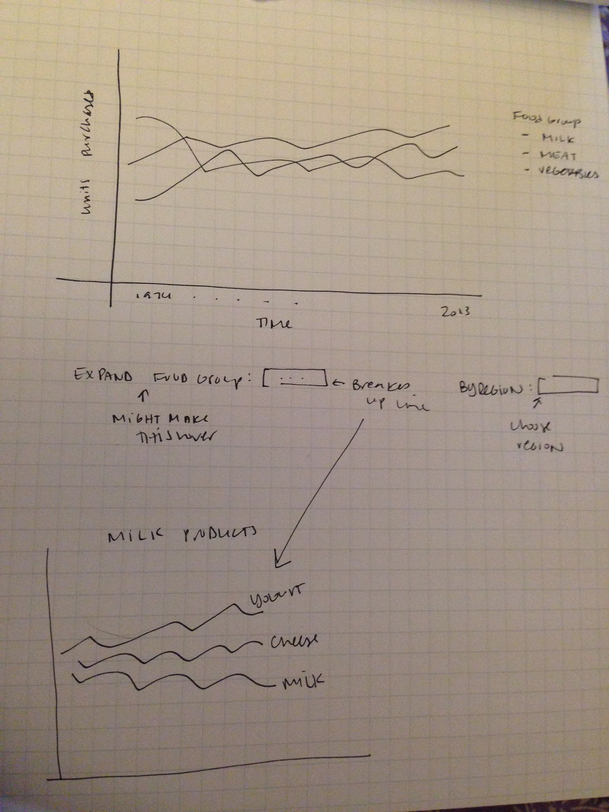
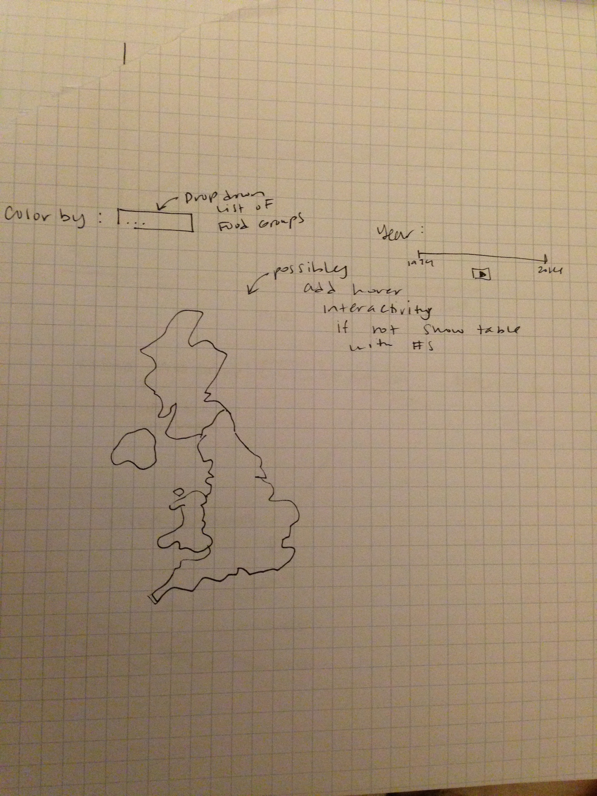

Project: Sketch
==============================

| **Name**  | Rachel Smith  |
|----------:|:-------------|
| **Email** | rasmith2@dons.usfca.edu |

Project Sketch
==============================

## Planned Tools ##
I will probably use R's Shiny and ggplot2 packages to implement my visualizations. Although I'd really like to use D3 for this, I unfortuantely don't know enough to do a great job on this project. I might look into some map visualization tools to implement some of my techniques -- I'm thinking of doing a simple choropleth. I might also try to implement some simple techniques (like hovering for a line plot) in D3. 

## Planned Techniques ##

- Line plot

I'd defintely like to do some time series visualizations with this dataset. I think one useful visualization to implement would be a simple multi-line plot of food purchases over time with each line representing a food group. I'd add the interactivity of breaking these food groups out into more granualar groups -- for example, the line fats breaks down into margarine, butter, and oil. I'd also like to add the option of filtering by region. 

- Choropleth

Because I have the option of breaking this data down into regional purchases, it could be interesting to have a map based heat map of purchases by region, by year. I'd like to add in a small bit of animation and allow the user to 'play' the years. This way we could see the change in purchase habits by consumers over the years. 

- Parallel Coordinates Plot

I think that this technique could be interesting since I have numeric data that might be related (does more meat consumption imply less vegetable consumption?). Again, I'd like to add in the option to see these relationships by year. I'd also like to allow the user to choose which variables to show in this plot. 

- Small multiples line plot

This technique could go well with the other line plot. Users would have the option to separate out the line plot by a variable of choice (region, year span, etc. ). I am most likely going to focus on the other plots mentioned above because I think they offer more information, but I like this plot as a backup. 

## Planned Interaction ##

I'd like to add the options to filter or brush (depending on if I use D3) for the line plots. The choropleth will allow the user to choose which food variable to color by and for which year to show data (I'd like to add in a play button for the user to see the change over years). I want to also add in a hover feature or a table that shows the value of the variable for each region. For the parallel coordinates plot, I'd probably add in the options to choose which numeric variables to show and add a play button to see the change in variable relationships over the years. 

## Planned Interface ## 

